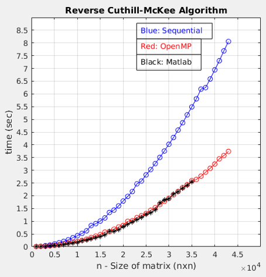
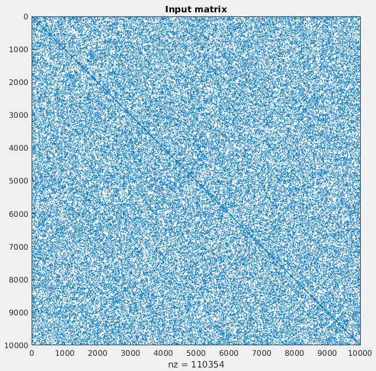
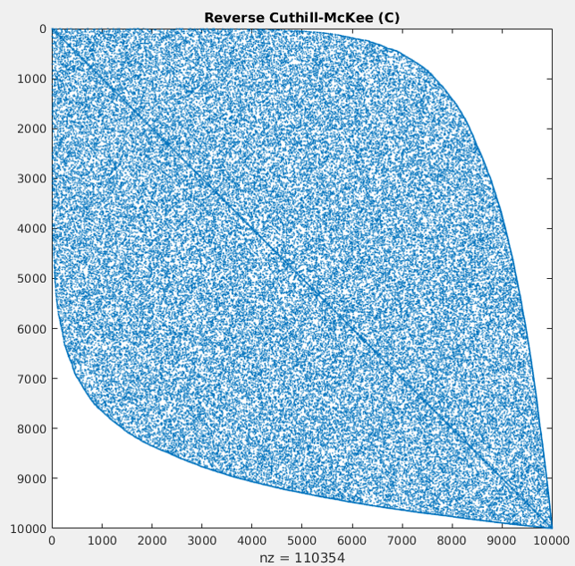
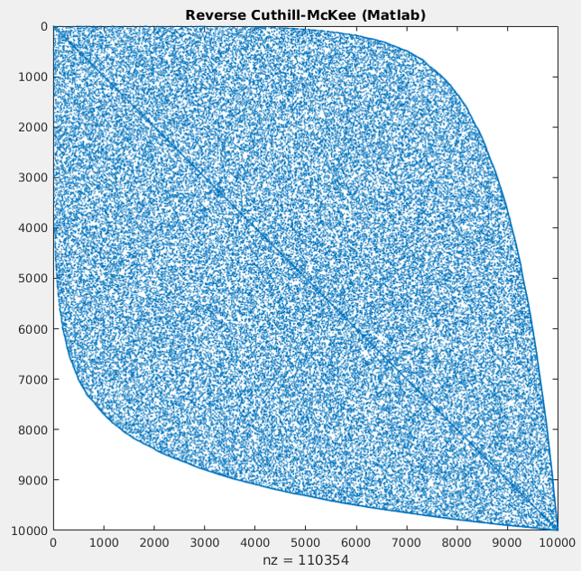

# Reverse Cuthill-McKee with OpenMP

## Description

Reverse Cuthill-McKee is an algorithm for generating a permutation for sparse matrices. This repo includes a sequential implementation of it, along with a parallel one using OpenMP.

## Observations
The only parts worth parallelizing are three, which are actually responsible for almost 80% of the total execution time. Despite them only being three, one can clearly see that OpenMP gave a great speedup indeed (up to 2.3 times faster) which is the same execution time as Matlab's official implementation.

### Execution times

All executions were done using Intel i7-7500U CPU, 8GB RAM, 4GB Swap Memory, with a 0.1% matrix density. Three implementations are being compared (sequential, parallel, matlab official).

| Comparison between all implementations    | Speedup achieved using OpenMP         |
|:-----------------------------------------:|:-------------------------------------:|
|  |  |

### Output evaluation

From the images below, one can see that this RCM implementation is an accurate one, since it’s almost the same result as matlab, which is valid. This specific test was made for n=10000 and density=0.1%.

| Input matrix                      | Output achieved with C            | Output achieved with Matlab                 |
|:---------------------------------:|:---------------------------------:|:-------------------------------------------:|
|  |  |  |

## How to run it

1. If your gcc version is previous than gcc-7, then change it in the Makefile
2. Type ``make`` to compile all implementations, or ``make <exec_name>`` to compile
only one implementation
3. Execution:
    1. Sequential: ``./sequential arg1 arg2 arg3``
    2. OpenMP: ``./openmp arg1 arg2 arg3``

The three arguments, are:
* arg1: n, size of matrix (nxn)
* arg2: density, percentage of non-zero elements
* arg3: filename, write the input and output matrix to a file

The third argument is optional. If no third agument is given, then the program will only calculate the permutation derived from the RCM algorithm, and print the elapsed time. If a third argument is given, then the program apart from the permutation, will also calculate input and output bandwidth, and write the input and output matrices in two files (using the argument in the file names).

If no arguments are included at the run command, then the executable will run with default values (n=500, density=1%). 

